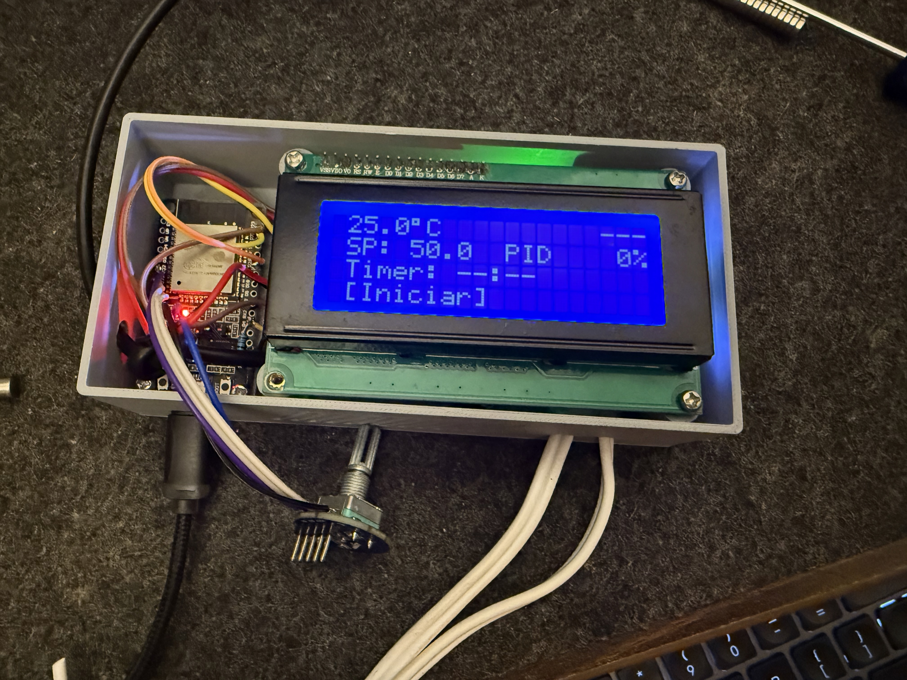
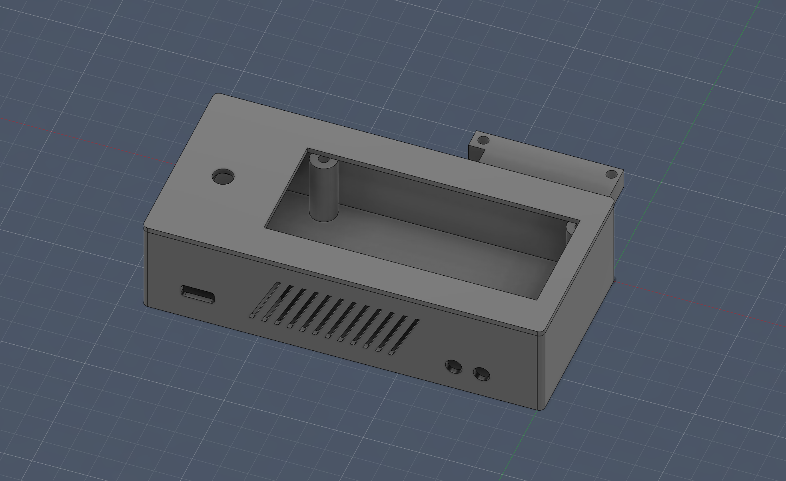

# ESP32 PID Thermostat

An ESP32-based temperature controller with local interface (20x4 LCD + rotary encoder) and remote control (Blynk IoT). Designed to work 100% offline — WiFi is optional and never blocks local control.


## Features

- 3 control modes: hysteresis, PID on/off, and PID time-proportional window
- Auto-tune via relay feedback (Tyreus-Luyben) for automatic PID calibration
- 10 equipment presets (Kp, Ki, Kd, window) saved to NVS
- Timer up to 24h with automatic shutdown
- Temperature graph on LCD with 7 time scales (10min to 12h)
- Power loss recovery with automatic resume
- Safety system: overtemperature, sensor failure, and stuck relay detection
- Configurable backlight timeout
- Uptime counter on home screen
- Bidirectional Blynk sync every 2s

---

## Photos

| Assembled on bench | Installed on oven |
|---|---|
|  |  |

---

## Bill of Materials

| Component | Description | Qty | Notes |
|---|---|---|---|
| ESP32 DevKit V1 | Microcontroller (or ESP32-S3) | 1 | Any ESP32 board with enough GPIOs |
| DS18B20 | Digital temperature sensor (OneWire, 12-bit) | 1 | Waterproof probe version recommended |
| Relay module | 1-channel, active HIGH | 1 | Rated for your heater's current |
| LCD 20x4 I2C | Character display with PCF8574 backpack | 1 | I2C address 0x27 or 0x3F |
| KY-040 | Rotary encoder with push button | 1 | 5-pin module (CLK, DT, SW, +, GND) |
| 4.7k ohm resistor | Pull-up for DS18B20 data line | 1 | 1/4W, between DATA and 3.3V |
| Jumper wires | Dupont cables for connections | ~15 | Male-to-female recommended |
| USB cable | Power and programming | 1 | Micro-USB or USB-C depending on board |
| 3D printed case | Enclosure (optional) | 1 | STL file included below |

---

## 3D Printed Case



**Download:** [oven_controller_case.stl](docs/3d/oven_controller_case.stl)

Print settings: PLA, no supports, 0.2mm layer height. Has openings for LCD, encoder, USB port, and ventilation slots.

---

## Wiring

### ESP32 DevKit V1

```
GPIO 4  ── DS18B20 DATA (4.7k pull-up to 3.3V)
GPIO 23 ── Relay IN
GPIO 21 ── LCD SDA (I2C)
GPIO 22 ── LCD SCL (I2C)
GPIO 26 ── LCD Backlight
GPIO 32 ── Encoder CLK (S1)
GPIO 33 ── Encoder DT (S2)
GPIO 25 ── Encoder SW (button)
```

### ESP32-S3

GPIOs 22-34 are not available on S3-WROOM. Use this alternative pinout:

```
GPIO 4  ── DS18B20 DATA
GPIO 5  ── Relay IN
GPIO 8  ── LCD SDA (I2C)
GPIO 9  ── LCD SCL (I2C)
GPIO 18 ── LCD Backlight
GPIO 16 ── Encoder CLK (S1)
GPIO 17 ── Encoder DT (S2)
GPIO 15 ── Encoder SW (button)
```

All pins are configurable in `src/config.h`.

> **Important:** Power the encoder with **3.3V**, not 5V. ESP32 GPIOs are not 5V tolerant.

> The LCD I2C address (`LCD_ADDR`) is set to `0x3F`. If the display doesn't work, try `0x27` in `src/config.h`.

---

## Getting Started

### Prerequisites

- [PlatformIO](https://platformio.org/) (CLI or VS Code extension)
- USB cable for the ESP32

### Step by step

**1. Clone the repository**

```bash
git clone https://github.com/YOUR_USER/esp32-pid-thermostat.git
cd esp32-pid-thermostat
```

**2. Set up credentials**

Copy the example file and fill in your data:

```bash
cp include/credentials.h.example include/credentials.h
```

Edit `include/credentials.h` with your WiFi SSID, password, and Blynk tokens:

```cpp
#define WIFI_SSID       "your-wifi-ssid"
#define WIFI_PASS       "your-wifi-password"
#define BLYNK_TMPL_ID   "your-template-id"
#define BLYNK_TMPL_NAME "PID Thermostat"
#define BLYNK_TOKEN     "your-auth-token"
```

> Blynk is optional. If not configured, the system works normally offline.

**3. Adjust the board (if needed)**

`platformio.ini` is configured for `esp32dev`. For ESP32-S3, change:

```ini
board = esp32-s3-devkitc-1
```

And adjust the pins in `src/config.h` as shown above.

**4. Build**

```bash
pio run
```

**5. Upload**

```bash
pio run --target upload
```

**6. Serial monitor (optional)**

```bash
pio device monitor
```

Dependencies (Blynk, OneWire, DallasTemperature, LiquidCrystal_I2C, ESP32Encoder) are downloaded automatically by PlatformIO.

---

## Control Modes

### Hysteresis

Simple on/off control with deadband.

- T >= SetPoint → relay OFF
- T <= SetPoint - Offset → relay ON
- In between → hold current state

### PID On/Off

Full PID computation, relay switches based on threshold.

- PID output > Threshold → relay ON
- PID output <= Threshold → relay OFF
- Threshold configurable (default 50%)

### PID Window (Time-Proportional)

PID output mapped to duty cycle over time. Example: 65% output with 10s window = relay ON for 6.5s, OFF for 3.5s.

The relay only changes state when the time in the current state exceeds the PID-calculated duration. This prevents excessive switching and protects mechanical relays.

---

## Navigation (Encoder)

The encoder navigates in 3 levels:

| Action | Result |
|---|---|
| Rotate (screen level) | Switch between Home, Graph, Config, Auto-Tune |
| Click (screen level) | Enter screen items |
| Rotate (item level) | Move cursor between items |
| Click (item level) | Edit selected item |
| Rotate (edit level) | Change value |
| Click (edit level) | Confirm and return to items |
| Long press | Return to screen level. If already there, go to Home |

All menus wrap around: last item continues to first.

### Backlight

Configurable timeout: always on, 1min, 5min, or 10min. When off, any interaction first turns on the screen (without triggering actions). After 0.5s, the encoder resumes normal operation.

---

## Screens

### Home

```
 75.3°C  01:05:30 ON
 SP: 80.0 Histerese
 Timer: 01:30
>[Iniciar]   Forno1
```

| Line | Content | Editable |
|---|---|---|
| 0 | Temperature + uptime counter + relay state | No |
| 1 | SetPoint + mode (+ PID output % if active) | SetPoint |
| 2 | Timer (`--:--` if disabled, `HH:MM:SS` countdown) | Timer HH:MM |
| 3 | Start/Stop button + active preset name | Start/Stop |

### Graph

```
 95 -▇▅▃▂▁▁▂▃▅▇▇████
>80  ▁▂▃▅▇████████▇▅▃
 65  ▁▁▁▁▁▁▁▁▁▁▁▁▁▁▁▁
    0          [10m]
```

- 3 rows of bars (24 pixels vertical resolution)
- Left scale with `>` marking the SetPoint row
- Horizontal marker at the exact SP pixel
- Scales: 10m, 30m, 1h, 2h, 4h, 8h, 12h (saved to NVS)
- Sampled every 30s, up to 12h of history

### Settings

| Item | Visible when | Range | Step |
|---|---|---|---|
| Offset | Always | 0.5–10.0°C | 0.5 |
| Mode | Always | Hysteresis / PID On/Off / PID Window | Cycle |
| Kp | PID mode | 0–999 | 0.1 |
| Ki | PID mode | 0–999 | 0.001 |
| Kd | PID mode | 0–9999 | 1.0 |
| Window | PID Window | 2–300s | 1s |
| Threshold | PID On/Off | 10–90% | 5% |
| Backlight | Always | Always / 1min / 5min / 10min | Cycle |
| Presets | Always | Opens preset submenu | — |

Changing Kp, Ki, Kd, or Window automatically resets the PID state for immediate effect.

### Auto-Tune

Dedicated screen (4th screen). Available only in PID modes. During execution shows temperature, SP, cycle count, ETA, previous/current cycle duration, and total elapsed time.

### Presets

Accessible via Settings > Presets. Each preset stores Kp, Ki, Kd, and window for a specific piece of equipment. Max 10 presets with names up to 12 characters.

---

## Auto-Tune

Relay feedback method with Tyreus-Luyben constants (less overshoot than classic Ziegler-Nichols).

1. Relay oscillates around SetPoint (ON below, OFF above)
2. Measures amplitude and period of each oscillation
3. Averages Ku and Tu over 5 cycles
4. Applies: Kp = 0.33 Ku, Ki = Kp / (0.5 Tu), Kd = 0.33 Kp Tu

Multi-cycle averaging and conservative constants produce more stable parameters with less overshoot for thermal systems.

---

## Timer

- Configurable in HH:MM on the Home screen (max 24h)
- `00:00` = no timer (runs indefinitely)
- Counts down while the system is active
- On expiry: deactivates the system and turns relay OFF
- Remaining time is preserved across power loss recovery

---

## Safety

### Overtemperature (>= 100°C)

Relay OFF immediately. System deactivated. Error screen with backlight flashing (1s on/1s off).

### Sensor failure (no reading for 5s)

Relay OFF. System deactivated. Error screen showing last known temperature.

### Stuck relay

After overtemperature, if temperature keeps rising 10°C above the cutoff point (after 30s wait for thermal inertia), the firmware concludes the relay may be mechanically stuck. Toggles the GPIO 10 times rapidly to try to free the contact. Shows error screen.

### Other protections

- Safe boot: relay always starts OFF
- Watchdog: 8s timeout = automatic reset
- Non-blocking WiFi: never interferes with local control
- Reading validation: values outside -50°C to 150°C are discarded

---

## Power Loss Recovery

If the system is active during a power outage, on reboot it shows:

```
Ciclo interrompido!
Continuar?      18s

  [SIM]       NAO
```

- YES is pre-selected, 20s timeout = automatic resume
- Timer continues from where it stopped (does not reset)
- State saved to NVS every 30s and on every state change

---

## Blynk

Bidirectional sync every 2s. Local changes (encoder) reflect in the app and vice-versa.

| Pin | Direction | Description |
|---|---|---|
| V0 | Read | Temperature (°C) |
| V1 | Write | SetPoint (30–100°C) |
| V2 | Read | Relay (0/1) |
| V3 | Write | Offset (0.5–10°C) |
| V4 | Write | Mode (0=Hysteresis, 1=PID On/Off, 2=PID Window) |
| V5 | Write | Kp |
| V6 | Write | Ki |
| V7 | Write | Kd |
| V8 | Write | PID window (seconds) |
| V9 | Read | PID output (0–100%) |
| V11 | Write | System active (0/1) |

---

## Project Structure

```
esp32-pid-thermostat/
├── docs/
│   ├── images/
│   │   ├── project-assembled.jpeg
│   │   ├── project-detail.jpeg
│   │   └── 3d-model-preview.png
│   └── 3d/
│       └── oven_controller_case.stl
├── include/
│   ├── credentials.h.example    ← template (tracked by git)
│   └── credentials.h            ← your real data (in .gitignore)
├── src/
│   ├── config.h                 ← pins, constants, limits
│   ├── state.h / .cpp           ← shared state between modules
│   ├── encoder.h / .cpp         ← ESP32Encoder (PCNT hardware) + button
│   ├── display.h / .cpp         ← LCD, 4 screens, graph, presets, errors
│   ├── storage.h / .cpp         ← NVS: settings, presets, recovery
│   ├── control.h / .cpp         ← PID with anti-windup, hysteresis, relay
│   ├── timer_ctrl.h / .cpp      ← countdown timer
│   ├── autotune.h / .cpp        ← relay feedback Tyreus-Luyben
│   └── main.cpp                 ← setup, loop, WiFi, Blynk, safety
├── lib/                         ← local libraries
├── platformio.ini
├── .gitignore
└── README.md
```

---

## Troubleshooting

| Problem | Solution |
|---|---|
| LCD doesn't turn on | Check 5V power to LCD. Try `LCD_ADDR` 0x27 or 0x3F |
| Encoder direction reversed | Swap `ENCODER_CLK_PIN` and `ENCODER_DT_PIN` in `config.h` |
| Encoder skips steps | Adjust `ENCODER_STEPS_PER_DETENT` (try 2 or 8) |
| Temperature shows -127 or 0 | Check 4.7k pull-up resistor and DS18B20 wiring |
| Relay doesn't switch | Verify module is active HIGH. Check pin assignment |
| WiFi won't connect | System continues offline. Check SSID/password in `credentials.h` |
| Credentials compile error | Copy `credentials.h.example` to `credentials.h` |
| ESP keeps resetting | Check watchdog (8s). Look at serial for `Guru Meditation Error` |
| `Invalid pin selected` | GPIOs 22-34 don't exist on ESP32-S3. Adjust `config.h` |

---

## License

MIT
